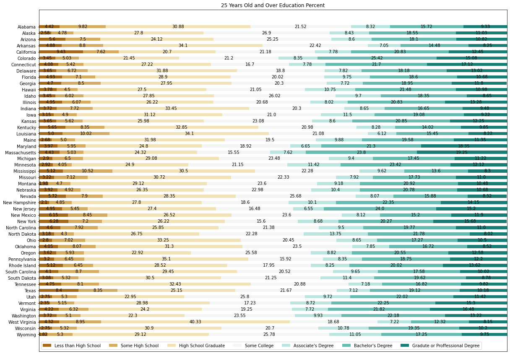
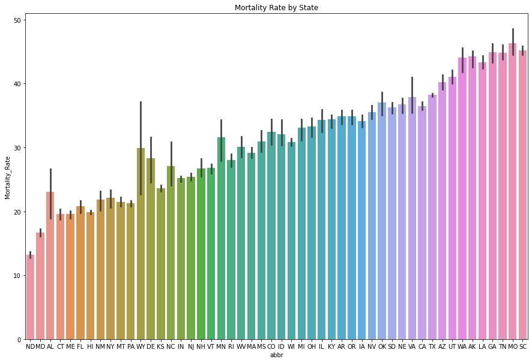

<h1>Alzehimer's Mortaitly Rate Estimator: Project Overview</h1>

<ul>
	<li>Using survey data, to estimate Alzehimer's Mortaitly Rates with in with an RMSE of about 5.68</li>
	<li>Found that education was an important factor in predicting Mortaitly Rates</li>
	<li>Combinded features to create a bad health score and health check score</li>
	<li>Tested linear, Lasso, e_net, support vector, forest, and light regression models</li>
	<li>Used a gridsearch to optimize the best performing model</li>
</ul>
<h3>Code used</h3>
Python Version 3.8.5  
Packages: numpy, pandas, matplotlib, seaborn, lightgbm

<h3>Data</h3>

<ul>
	<li>Survey data, <a href="https://chronicdata.cdc.gov/Healthy-Aging/Alzheimer-s-Disease-and-Healthy-Aging-Data/hfr9-rurv">Alzheimer's Disease and Healthy Aging Data</a>
	<li>Mortaitly Rates by State, <a href="https://www.cdc.gov/nchs/pressroom/sosmap/alzheimers_mortality/alzheimers_disease.htm">Alzheimer's Disease Mortality by State</a>
	<li>Aqi data, <a href="https://wonder.cdc.gov/">CDC wonder</a>. Once on the website I selected "Fine Particulate Matter" then groupby State and Year.
	<li>Education data, <a href="https://data.census.gov/cedsci/table?t=Educational%20Attainment&g=0100000US.04000.001&y=2015&tid=ACSST1Y2015.S1501&moe=false&tp=false&hidePreview=true">EDUCATIONAL ATTAINMENT</a> downloaded years 2015-2018
</ul>

<h3>Data Cleaning</h3>

 
After I obtianed the data, I needed to clean it up and put into a workable structure. Here are the steps I took for each data set:

<h4>Alzheimer's Disease and Healthy Aging Data</h4>
	<ol type="1">
		<li>Dropped redundant and empty columns</li>
		<li>Selected only overall stratifcations for age, sex, and race</li>
		<li>Dropped Questions about cognitive decline</li>
		<li>Flattened the data, so that Year and State are the keys and the questionID are the columns</li>
		<li>Selected only states in the united states</li>
	</ol>
	
<h4>Mortaitly Rates by State</h4>
	<ol type="1">
		<li>Selected only years 2015-2018</li>
		<li>Sorted by Year and State</li>
		<li>Added data to main dataframe</li>
	</ol>
<h4>Aqi Data</h4>
	<ol type="1">
		<li>Grouped the data by state and year by mean</li>
		<li>Selected only states</li>
		<li>Added data to main dataframe</li>
	</ol>
<h4>Education Data</h4>
For Each Year in 2015-2018
	<ol type="1">
		<li>I Parsed the Data to obtain:
			<ul>
				<li>Education attaiment for 18 to 24 years old</li>
				<li>Education attaiment for 25 years old and over</li>
			</ul>
		</li>
		<li>Selected only United States
		<li>Sorted and concated to the main dataframe</li>
	</ol>

<h3>EDA</h3>
I created a corelation matrix and looked at education percents by states. Here are some highlights. 

<h3>Model Building</h3>

Since the dataset is small, I needed to make sure the train set wasn't skewed, so I chose a stratified train/test split, with a test size of 20%.
To handle null values, I dropped columns with less than 50% of non-nulls. For the remaining colums with the null values, I filled the null values with the mean. Lastly, I applied a standard scaler to the data.

I used root mean squared error to evaluate my models. I went with rmse, because I didn't want to have huge outliers since the range for mortality rates was between 13~49%, not in the thousands. Also, RMSE could give me an
idea of how far off the model was. 

I tested five models. I used Lasso as a baseline, and I thought that many features could be weighted to 0. I figured that Elastic net would have a better score because there are more features than number of instances
and the education data would be correlated. I tested a support vector regressor just for fun, I didn't play around with the parameters at all. If I had to go back I would test out different kernels. The data didn't seem
very linear when looking at the different graphs, so I thought a random forest regressor would find nonliear relationships in the data, that a linear regressor wouldn't be able to find. To test another tree based
model, I went with a LGBMRegressor, which I thought peform the best.

<h3>Model Performance</h3>
<li>LGBMRegressor RMSE: 6.19</li>
<li>Random Forest Regressor RMSE: 6.72</li>
<li>Support Vector Regressor RMSE: 7.83</li>
<li>Lasso RMSE: 7.89</li>
<li>Elastic net RMSE: 8.10</li>

